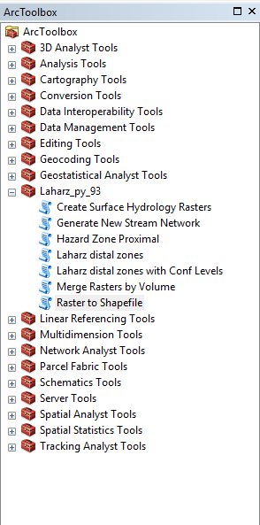
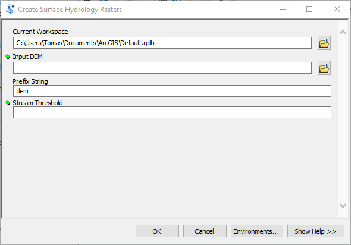
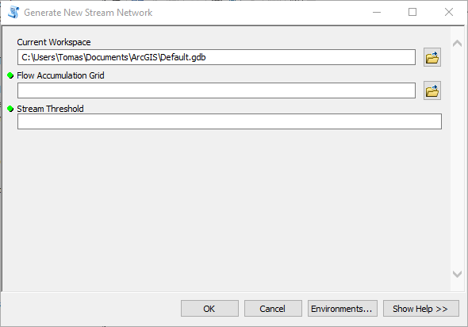
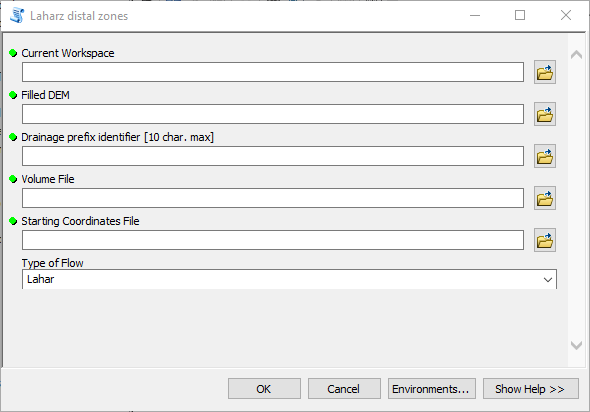
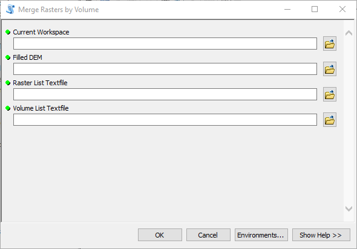
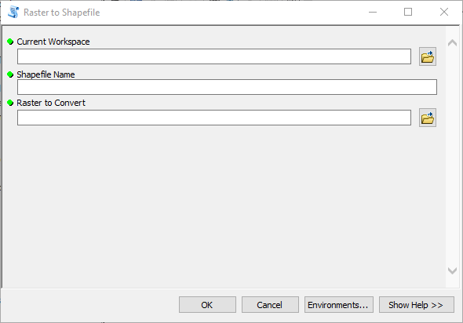

# Manual Laharz_py

## Instalación y Configuración

Descargar el [archivo](archivo) desde la página oficial del projecto:
[http://pubs.usgs.gov/of/2014/1073/](http://pubs.usgs.gov/of/2014/1073/)

El archivo consta de las siguientes carpetas y archivos:

- laharz_py (carpeta)
- laharz_textfiles (carpeta)
- laharz_shapefiles (carpeta)
- mtrain_example (carpeta)
- Laharz_py_93.tbx (carpeta)
- Laharz_py.tbx (carpeta)

La carpeta *laharz_py* y los archivos *Laharz_py_93.tbx* y *Laharz_py.tbx* se deben copiar en *C:/Users/<nombre de usuario>/Documentos/ArcGIS/*.

(imagen de referencia)

Para instalar las herramientas en ArcMap:

- Abrir ArcMap
- Abrir la ventana Caja de Herramientas (Toolbox) e instalar la caja de herramientas Laharz_py_93 (Click derecho en la carpeta principal (Arc Toolbox) > Agregar Herramientas (Add Toolbox) > Buscar el archivo Laharz_py_93.tbx)
- Aparece la caja de herramientas Laharz_py_93.

### Recomendaciones

El geoprocesamiento en segundo plano es una opción que viene activada por defecto en ArcGIS 10, pero con algunas herramientas causa problemas. Para desactivarlo se debe:

- Abrir ArcMap
- Click en *Geoprocesos (Geoprocessing)* > *Opciones de Geoprocesos (Geoprocessing Options)*
- Dentro de *Opciones de Geoprocesos* desactivar la opción *Geoprocesamiento en segundo plano (Background Geoprocessing)*
- Click en el botón *Ok*

### Carpetas de proyecto

Las carpetas *laharz_shapefiles* y *laharz_textfiles* son carpetas que deben estar presentes en cada proyecto donde se vayan a usar las herramientas de laharz_py.

La estructura de carpetas para cada proyecto debería ser la siguiente:

- Proyecto
    + laharz_shapefiles
    + laharz_textfiles
    + Proyecto.mxd

[archivo]: http://pubs.usgs.gov/of/2014/1073/downloads/laharz_py_example.zip

## Uso

### Preparación del Espacio de Trabajo

Se debe cambiar la carpeta del Espacio de Trabajo (Workspace) a la carpeta del proyecto en en que se esté trabajando. Para hacer esto se debe:

- Click en *Geoprocesos (Geoprocessing)* > *Entornos (Environments)*
- Expandir la sección *Espacio de Trabajo (Workspace)* y cambiar *Current Workspace* y *Scratch Workspace* por la carpeta del proyecto en el que estemos trabajando

### Uso de las herramientas

La caja de herramientas contiene siete herramientas:

- Create Surface Hydrology Rasters
- Generate New Stream Network
- Hazard Zone Proximal
- Laharz distal zones
- Laharz distal zones with Conf Levels
- Merge Rasters by Volume
- Raster to Shapefile



Las primeras tres tipicamente se usan una sola vez por proyecto para generar los sets de datos usados en las simulaciones. Las herramientas *Merge Rasters by Volume* y *Raster to Shapefile* usualmente se usan cuando todas las simulaciones están completas. Ambas herramientas de *Laharz distal zones* se usan todas las veces que sea necesario, usualmente una vez por cada canal de drenaje de cada cuenca.

#### Paso 1: Create Surface Hydrology Rasters

Al hacer doble click en la herramienta se abre una ventana para ingresar los datos requeridos por ella. Esta herramienta recibe como entrada un DEM (Digital Elevation Model) y un Umbral de Red de Drenaje (Stream Threshold). Además se ingresa un prefijo que se usará para nombrar los archivos que se generen como producto de esta herramienta.

- Lo primero es asegurarse que el Espacio de Trabajo actual (Current Workspace) sea la carpeta para el proyecto en el que estamos trabajando.
- Luego hay que indicar cual es el archivo del DEM que se va a usar. Esto se puede hacer de dos formas:
    1. Si tenemos el DEM agregado como un elemento del mapa que tenemos abierto, se puede arrastrar desde la Tabla de Contenidos (Table of Contents) hasta el campo Input DEM en la ventana de la herramienta.
    2. Hacemos click en el ícono de la carpeta  y vamos hasta la ubicación de nuestro archivo. [Nota: Puede ser necesario hacer una Conexión a la Carpeta (Folder Connection) usando el ícono de la carpeta con un signo "+"  ]
- Hay que indicar cual va a ser el prefijo de los archivos a crear. La recomendación es usar un prefijo que describa el área que se está estudiando (Si estudiamos el Volcán Osorno, usar el prefijo 'osr'). [Nota: No usar prefijos que contengan doble ele 'll', producen un error en la herramienta]
- También se tiene que indicar un Stream Threshold. Este parámetro define que parte de la red de drenaje se considera un canal. Números más altos indican que los canales serán partes más proundas de la red. Un valor default para empezar es 1000.

Una vez ingresados todos los parámetros de entrada se hace click en el botón Ok y la herramienta se ejecutará.

Esta herramienta crea un raster de canales que identifica las celdas en donde la acumulación de flujo es igual o mayor al Stream Threshold. Además va rellenando en el DEM las depresiones en el cauce del canal para asegurar que el flujo sea continuo en las simulaciones, y también generará un raster de la dirección del flujo, de acumulación de flujo y un raster de redes de drenaje. Estos cuatro rasters que se generan se llamarán con el prefijo que definamos, y con el sufijo "fill" para el DEM rellenado, "dir" para la dirección de flujo, "flac" para la acumulación de flujo y "str" para las redes de drenaje. Por ejemplo, si estamos estudiando el Volcan Osorno y nuestro prefijo es "osr", los archivos generados serán: osrfill, osrdir, osrflac y osrstr; los cuales se guardaran en el Espacio de Trabajo actual (Current Workspace). Es muy importante notar que de ahora en adelante en todas las herramientas el usuario debe usar el DEM rellenado (con sufijo "fill"), en vez del DEM original.



#### Paso 2: Generate New Stream Network
Si fuese necesario se puede crear otro archivo de redes de drenaje usando otro valor para el Stream Threshold. En este caso la herramienta reutiliza el raster de acumulación de flujo (terminado en "flac") generado con la primera herramienta (Create Surface Hydrology Rasters). Los parámetros que se usan son los siguientes:

- Current Workspace: Cambiar a la carpeta del proyecto en el que estamos trabajando.
- Flow Accumulation Grid: Se selecciona el archivo de acumulación de flujo creado anteriormente.
- Stream Threshold: Este parámetro define que parte de la red de drenaje se considera un canal. Números más altos indican que los canales serán partes más proundas de la red.



#### Paso 3: Hazard Zone Proximal
Esta herramienta calcula la Zona de Peligro Proximal del volcán. Los siguientes parámetros son necesarios:

- Current Workspace: Cambiar a la carpeta del proyecto en el que estamos trabajando.
- Filled DEM: Se selecciona o ingresa el DEM Rellenado que se creó anteriormente.
- Stream Grid: Se ingresa el raster de redes de drenaje
- Slope Value: Este parámetro se refiere a un cono de H/L
- Cone Apex Type: Hay tres formas de enegir el apice de la zona de estudio. Estas son:
    - Maximum_Elevation: Si dentro del área del DEM el ápice (cima) del volcán es la parte más alta, esta opción es la recomendada, ya que lo detectará automáticamente.
    - Textfile: Archivo de texto con las coordenadas del ápice del volcán extraídas manualmente. El archivo de texto debe usar coordenadas UTM, con punto para el separador de decimales, y un coma para separar el valor Este del Norte. Ejemplo del contenido del archivo de texto:

    ```
     587737.23,5204869.78
    ```

    - XY coordinates: Ingreso manual de las coordenadas XY (Este, Norte) en la ventana de la herramienta.


#### Paso 4: Laharz distal zones
Esta herramienta generará rasters para cada canal a estudiar. Cada raster tendrá el modelo de uno o más volúmenes para el flujo a modelar. Los parámetros son:

- Current Workspace: Seleccionar la carpeta del proyecto en el que estamos trabajando.
- Filled DEM: Se selecciona o ingresa el DEM rellenado que se creó anteriormente.
- Drainage prefix identifier: Es el prefijo para el nombre de los archivos creados para cada volumen calculado. Puede tener un máximo de 10 caracteres. Ejemlo: villar_
- Volume File: En este archivo de texto se especifican hasta 7 volúmenes para modelar. Los volúmenes se miden en metros cúbicos, y el archivo de texto debe tener el siguiente formato:

```
 100000, 300000, 500000
```

- Starting Coordinates File: Este archivo de texto contiene los puntos de inicio de las simulaciones para cada canal de la red de drenaje a modelar. Una restricción es que los puntos de inicio no pueden estar muy lejos de un canal presente en la red de drenaje generada anteriormente, sino la herramienta generará errores. Los datos para cada punto de inicio para cada canal se debe escribir en una línea distinta. Las coordenadas deben estar en UTM, los decimales separados por puntos, la coordenada este separada del oeste por una coma. El contenido del archivo se ve así:
```
587737,5204869
579305,5196801
577930,5191581
```
En este caso la herramienta generaría 3 rasters (uno para cada canal llamados). Ejemplo: villar_1, villar_2, villar_3

- Type of Flow: Las herramientas de Laharz_py pueden modelar tres tipos de flujos. Se selecciona el tipo de evento a modelar, que puede ser:
    - Lahar: Lahar
    - Debris Flow: Flujo de detritos
    - Rock Avalanche: Avalancha de rocas




#### Paso 5: Laharz distal zones with Conf Levels (opcional)
Esta herramienta sirve para hacer una estimación del alcance de un lahar de acuerdo a un intervalo de confianza específico escogido por el usuario. Los parámetros que usa son los siguientes:

- Current Workspace
- Filled DEM
- Drainage Name
- Volume Textfile: Sólo se acepta un volumen por archivo, a diferencia de la herramienta anterior que acepta hasta siete volúmenes. Las unidades de este volumen son metros cúbicos.
- Coordinates Textfile
- Confidence Limits: Define el Intervalo de Confianza. Utiliza valores entre 50 y 99.


#### Paso 6: Merge Rasters by Volume
Esta herramienta se usa cuando se quieren combinar en un raster todos los modelos de un mismo volumen calculados para distintos canales. Generará un raster por cada volumen calculado y los llamará merge_2, merge_3 y así sucesivamente. Los parámetros son los siguientes:

- Current Workspace
- Filled DEM
- Raster List Textfile: Archivo de texto con los nombres de los raster generados por la herramienta _Laharz distal zones_ que se quieren combinar por volumen. Cada nombre debe estar separado por una coma. Ejemplo:
```
villar_1,villar_2,villar_3
```
- Volume List Textfile: Es el mismo archivo usado en la herramienta _Laharz distal zones_.



#### Paso 7: Raster to Shapefile
El paso final es transformar los raster combinados por volumen en archivos shapefile. Los parámetros son:

- Current Workspace
- Shapefile Name: El nombre del shapefile a crear.
- Raster to Convert: Seleccionar el raster a convertir.



